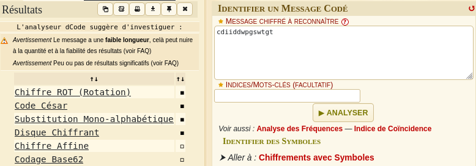
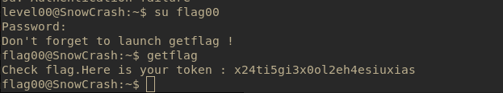

# Level00

### Description
Connect to the vm using login `level00:level00`

The level 00 user doesn't have any special files, so we need to find the flag somewhere else.
Home directory being empty we will search for any file belonging to the user we want to connect *flag00*


## Solution
- Use `find` in all folders to search for files owned by the user `flag00` .<br>
Any errors are redirected to `/dev/null` to prevent flooding the terminal. <br>
cat those files to see what's in them .

```bash
find / -user flag00 2>/dev/null | xargs cat 
```
- Opening the *john* file we found we got a charactere string: **cdiiddwpgswtgt**<br>
Unfortunately , this is not the password for `su flag00` but we can attempt to decrypt it with dcode .

- This is a caesar cipher with a shift of 15 character. __(ROT +15)__



- We found the password for `flag00`:
__nottoohardhere__

- Use `getflag` to get the flag token.


