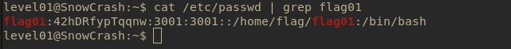

# Level01

## Description
The level 01 user doesn't have any special files, so we need to find the flag somewhere else.

## Solution
Use `cat /etc/passwd` to look for all user .



- We found  **42hDRfypTqqnw** . <br>
Unfortunately, this is not the password for `su flag01` but we can attempt to decrypt it with john the ripper on a kali vm.

```bash
john psw;
```


- This is a traditional crypt (3) DES 128/128 SSE2-16.

- We found the password for `flag01`:
__abcdefg__

- Use `getflag` to get the flag token.


#### Dead end
- Use `find` in all folders to search for files owned by the user or named `flag01` .<br>

