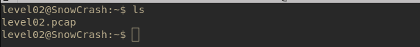
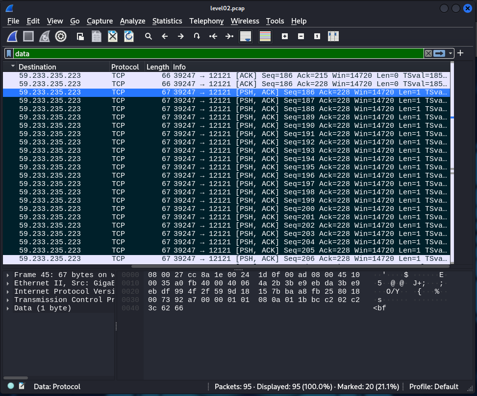

# Level02
## Description
The level 02 user has a file **level02.pcap**, so we will investigate in this direction.




## Solution
- Use `scp` to copy **level02.pcap** in a Kali Linux VM for analysis using **wireshark**.<br>

```bash
scp -P 4242 level02@192.168.56.3:level02.pcap;
```

- Open **wireshark** to inspect the captured data. <br>
We can observe that the password is transmitted within the data.



- `password: ft_wandr 0x7f 0x7f 0x7f NDRel 0x7f L0L \r`

<!-- Changed 7f to 0x7f to mark that it's hex --->

- We need to remove character because **0x7f** represent backspace in hexadecimal.<br> Finally, we found the password for `flag02`:
**ft_waNDReL0L**

- Use `getflag` to get the flag token.
