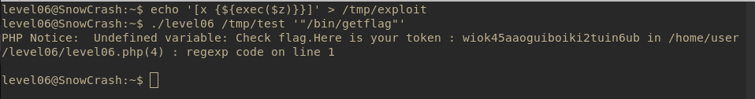

# Level06
## Description
There is a binary and a php script inside the home

##Solution

- Analysing script we can see that it is mostly string processing of the first argument of script using the function reg_replace, and by dissassembling the binary we can see that it is just calling the php script as a subroutine with the same arguments with give it

- Research bring us a possible solution the first reg_replace use the option */e* which *evaluate* the second argument as an expression and since this expression take part of this input we can probably inject some code there
> Since the part of the input is inside double quote we need to do some string interpolation to execute it

